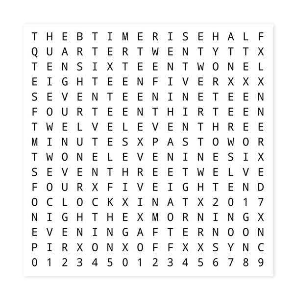
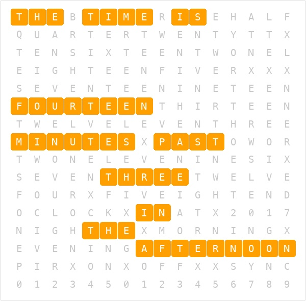

# CYD Word Clock

A word clock for the ESP32-2432S028R (CYD). Displays time as highlighted words in a
16×14 letter grid: "THE TIME IS FOURTEEN MINUTES PAST THREE IN THE AFTERNOON".

Ported from [Brett Oliver's Word Clock](https://www.brettoliver.org.uk/Word_Clock/Word_Clock.htm)
(wordclock_v4_9, Arduino Nano + 16×16 MAX7219 LED matrix).
Same grid layout and word logic — adapted for the CYD's ILI9341 TFT display.

## Hardware

ESP32-2432S028R (Cheap Yellow Display) — ILI9341 240×320, XPT2046 touch, LDR.

## Setup

1. Copy `include/secrets.h` and fill in your WiFi credentials.
2. Flash via PlatformIO (`pio run -t upload`).
3. On first boot, connect to the `CYD-WordClock` AP and configure WiFi.
4. Time syncs via NTP automatically. Timezone: Australia/Sydney.

## Display

Portrait 240×320. 16-column × 14-row letter grid occupying the upper 266px.
A status strip at the bottom shows HH:MM:SS and the date.
The word grid uses a monospaced GFX font for more even letter spacing.
The status strip is rendered through its own sprite to avoid bottom-of-screen flicker.

Exact-minute time phrases — e.g. "THE TIME IS THREE MINUTES PAST TWO IN THE AFTERNOON".

Touch and hold anywhere for ≥600ms to cycle brightness (4 steps).

Minute transitions can be animated with a configurable fade. The portrait display can
also be flipped 180° so the USB connector sits at the top.

### Grid layout

### Sample time — 2:14 PM

"THE TIME IS FOURTEEN MINUTES PAST THREE IN THE AFTERNOON"

## Web UI

Once connected to WiFi, open `http://<device-ip>/` in a browser.

### Clock tab — live grid preview

### Config tab — settings

Settings are saved to NVS and apply immediately — no reflash required.

| Setting             | Description                                         |
|:--------------------|:----------------------------------------------------|
| Display Flip        | Rotate portrait 180° (USB top or bottom)            |
| Default Brightness  | Backlight level on boot (0–255)                     |
| Brightness Min/Max  | Range for long-press cycling and LDR scaling        |
| Brightness Steps    | Number of long-press brightness levels              |
| Animation Type      | Instant or fade transition on minute change         |
| Fade Steps / Delay  | Tune fade speed (~14 steps × 18ms ≈ 540ms default) |
| LDR Auto Brightness | Enable/disable ambient light sensor scaling         |
| LDR Dark / Bright   | ADC thresholds for min/max brightness mapping       |
| Timezone            | Olson name e.g. `Australia/Sydney`                  |
| POSIX Fallback      | Offline DST rule e.g. `AEST-10AEDT,M10.1.0,M4.1.0/3` |

The **Maintenance** panel provides Reset Settings, Reset WiFi, and Factory Reset actions.

## Changing Timezone

Via the Web UI Config tab (preferred), or edit `NTP_TIMEZONE` and `NTP_POSIX_FALLBACK`
in `include/config.h` to change the compiled-in default.

## Display Tuning

Via the Web UI Config tab (preferred), or edit `include/config.h` to change compiled-in defaults:

- `DISPLAY_FLIP` — rotate portrait layout 180°
- `ANIM_TYPE` — choose instant or fade minute transitions
- `ANIM_FADE_STEPS` and `ANIM_FADE_MS` — tune fade speed
- `BRIGHTNESS_DEFAULT` — initial backlight level
